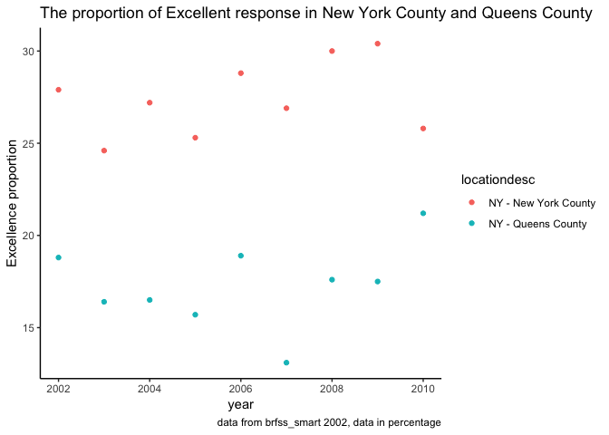

P8105\_hw2\_xz2809
================
Coco Zou
9/29/2018

``` r
library(tidyverse)
library(readxl)
```

Problem 1
---------

This problem focuses on NYC Transit data. Here is the **code chunk** to read the data

``` r
NYCtransit_data <-  read_csv(file = "./data/NYC_Transit_Subway_Entrance_And_Exit_Data.csv")
```

Now we are trying to clean the data, including retaining line, station, name, station latitude / longitude, routes served, entry, vending, entrance type, and ADA compliance. Also, we converted the entry variable from charater to logical variable. Here is the **code chunk**:

``` r
NYCtransit_data = janitor::clean_names(NYCtransit_data)
NYCtransit_data_retain = 
  select(NYCtransit_data,line:vending, ada, ada_notes) %>% 
  mutate(entry=recode(entry,'YES'=TRUE, 'NO'=FALSE)) %>% 
  mutate(vending=recode(vending,'YES'=TRUE, 'NO'=FALSE))
```

This dataset contains line, station name, station latitude and longtitude, routes served, whether there is entry and exist and the type of the entry, and ADA compliance. I imported the data first and then cleaned the names into all lower cases. Then I selected the only variables required, at last I converted the "entry" and "vending"(this is for future analysis) variable into logical variable "TRUE" and "FALSE". The diminsion of the given data is 1868, 21. This is not a tidy dataset yet, because the "route1" to "route11" are apparently data, but they appreared as variables at the first row. Therefore, we need do some reformatting later.

Now here is the **code chunk** to analyze the data:

``` r
num_stations = 
  distinct(NYCtransit_data_retain, line, station_name) %>% 
  nrow()

num_stations_ada = 
  filter(NYCtransit_data_retain, ada=='TRUE') %>% 
  distinct(NYCtransit_data_retain, line, station_name) %>% 
  nrow()

numerator = 
  filter(NYCtransit_data_retain,vending==FALSE & entry==TRUE) %>% 
  nrow()

denominator = 
  filter(NYCtransit_data_retain,vending==FALSE) %>% 
  nrow()

proportion =numerator/denominator
```

There are in total 465 distinct stations there and 84 stations are ADA compliant. Approximately, 0.3770492% of the stations with entrances and exists but without vending allow entrance.

Now we are trying to reformat the dataset:

``` r
NYCtransit_data_retain %>% 
  gather(key = route_number, value = route_name, route1:route11) %>% 
  filter(route_name=='A') %>% 
  distinct(station_name) %>% 
  nrow()
```

    ## [1] 56

``` r
NYCtransit_data_retain %>% 
  gather(key = route_number, value = route_name, route1:route11) %>% 
  filter(route_name=='A',ada==TRUE) %>% 
  distinct(station_name) %>% 
  nrow()
```

    ## [1] 16

There are 56 distinct stations serving A train and among the stations that serve the A train, there are 16 that are ADA compliant.

Problem 2
---------

This problem is about analyzing the data of Mr.Trash Wheel. Here is the **code chunk** to read and clean the data for mr trash wheel:

``` r
trashwheel_data <-  
  read_excel( "data/HealthyHarborWaterWheelTotals2018-7-28.xlsx",range = cell_cols("A:N"), ) %>% 
  janitor::clean_names() %>% 
  filter(!is.na(dumpster)) %>% 
  mutate(
    sports_balls = round(sports_balls),
    sports_balls = as.integer(sports_balls)
  )
```

Here is the **code chunk** to read and clean the precipitation data for 2016 and 2017.

``` r
precipitation_2016_data<-
  read_excel( "data/HealthyHarborWaterWheelTotals2018-7-28.xlsx",sheet = "2016 Precipitation", range = "A2:B15") %>% 
  janitor::clean_names() %>%
  mutate(
    year = 2016
  )

precipitation_2017_data<-
  read_excel( "data/HealthyHarborWaterWheelTotals2018-7-28.xlsx",sheet = "2017 Precipitation", range = "A2:B15") %>% 
  janitor::clean_names() %>%
  mutate(
    year = 2017
  )

combine_precipitation_data =
  rbind(precipitation_2016_data,precipitation_2017_data) %>% 
  filter(!is.na(month) & !is.na(total)) %>% 
  mutate(weight = total) %>% 
  select(-total)

combine_precipitation_data$month = 
  month.name[combine_precipitation_data$month] 
```

For the data of Mr Trash Wheel, there are in total 215 observations. The key variables in this data set is the weight of garbage has been salvaged, in tons and the total volume the trash that Mr Trash Wheel has salvaged. The other variables represents the number of plastic bottles had been picked up, the weight of polystyrene has been picked up, and the number of cigarette butts, glass bottles, grocery bags, chip bags and sports balls that had been gathered. The home power represents the n of trash equates to on average 500 kilowatts of electricity. An average household will use 30 kilowatts per day according to the given note. The median number of sports balls in a dumpster in 2016 is 26.

For the data of precipitation of 2016 and 2017, there are in total 24 observations, 12 with 2016 and 12 with 2017. The key variable, is the total weight of precipitation in the given month. The total precipitation in 2017 is 32.93.

Problem 3
---------

This problem analyzes the BRFSS data. Here is the **code chunk** that loads the data for problem 3:

``` r
library(p8105.datasets)
data("brfss_smart2010")
brfss_smart2010=
  janitor::clean_names(brfss_smart2010) %>% 
  filter(topic=="Overall Health") %>% 
  select(-topic) %>% 
  select(-class) %>% 
  select(-question) %>% 
  select(-sample_size) %>%
  select(-(confidence_limit_low:geo_location)) %>% 
  spread(key = response, value = data_value) %>% 
  janitor::clean_names() %>% 
  mutate(
    proportion = excellent + very_good
  )
```

``` r
dist_locations = distinct(brfss_smart2010, locationdesc) %>% 
  nrow()

brfss_smart2010 %>% 
  distinct(locationabbr)
```

The proportion of responses that were “Excellent” or “Very Good" is 0.031743. There are in total 404 unique locations included in the dataset. In America, there are 50 states and every state has been represented. The one more variable is "DC", which is not an acutual state but the capital of USA.

``` r
MaxTable <- function(x){
     m <- unique(x)
     m[which.max(tabulate(match(x,m)))]
}
MaxTable(brfss_smart2010$locationabbr)
```

    ## [1] "NJ"

``` r
brfss_smart2010$excellent=as.numeric(brfss_smart2010$excellent)
brfss_2002 = filter(brfss_smart2010, year==2002)
summary(brfss_2002$excellent)
```

    ##    Min. 1st Qu.  Median    Mean 3rd Qu.    Max.    NA's 
    ##   14.60   20.35   23.60   23.96   26.90   43.20       2

The most most observed state is NJ. The median of the “Excellent” response value is 23.60. Below two figures are histogram of “Excellent” response values in the year 2002 and scatterplot showing the proportion of “Excellent” response values in New York County and Queens County (both in NY State) in each year from 2002 to 2010, respectively.

``` r
ggplot(brfss_2002,aes(x=excellent))+geom_histogram()+
  labs(
    title="Excellent response value in 2002",
    x = "Excellence response proportion",
    y = "Count"
  )+
  theme_classic()
```


``` r
brfss_smart2010 %>% 
  filter(locationdesc == "NY - New York County" | locationdesc == "NY - Queens County") %>% 
  filter(year>2001 & year<2011) %>% 
  ggplot(aes(x=year,y=excellent,color=locationdesc))+geom_point() + 
  labs(
    title = "Excellent response values in New York County and Queens County",
    caption = "data from brfss_smart 2002",
    y = "Excellence proportion"
    )+
  theme_classic()
```


